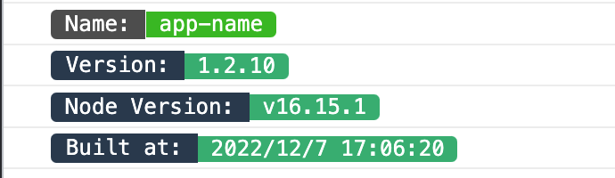

# rollup-plugin-entry-banner


[](https://www.npmjs.com/package/rollup-plugin-entry-banner)

[](https://travis-ci.com/jackluson/rollup-plugin-entry-banner)
[](https://codecov.io/gh/jackluson/rollup-plugin-entry-banner)
[](https://github.com/jackluson/rollup-plugin-entry-banner/blob/main/LICENSE)
## Introduction
A simple Rollup plugin to prepend content to entry chunk

As follows:


## Usage

Install the plugin
> npm install --save-dev rollup-plugin-banner


Add it to your rollup configuration:

```js
import entryBanner from 'rollup-plugin-entry-banner';
// const { bannerEntry } = require('rollup-plugin-entry-banner'); /* use commonjs */
export default {
  plugins: [
    entryBanner()
  ]
}
```
Note: it can also be used in  [Vite](https://github.com/vitejs/vite).
## Options


| name             |        type        | required | default                                             |                       description |
| :--------------- | :----------------: | :------: | :-------------------------------------------------- | ----------------------------------------------: |
| packageJsonDir   |      string     |  false   | `process.cwd()` |                    the directory path of The `package.json` file |
| preset    |       boolean       |  false   | true                                                  |         whether apply the preset of the banner style (It includes the log style shown in the above picture. ) |
| renderBanner    |       function       |  false   | undefined                                                  |        customize the output banner content |


## Other

- [console_output_with_css](https://developer.chrome.com/docs/devtools/console/api/#styling_console_output_with_css)
